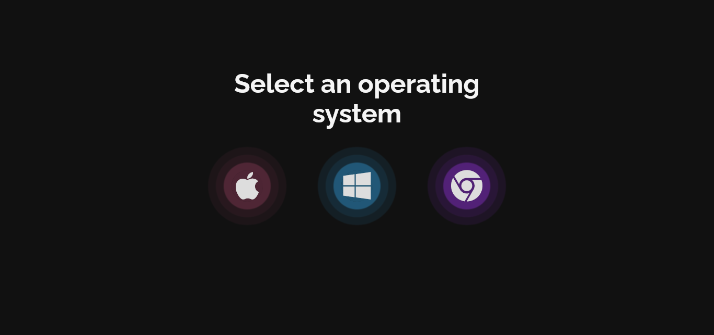

## CUSTOM DESIGN ANIMATED CHECKBOX WITH GLOW EFFECT

## Le challenge

Mon objectif a été de créer/concevoir des checkbox (cases à cocher) animées personnalisées, qui activent des icônes lors du clic en créant un effet lumineux en utilisant le HTML5 et le CSS3.

## Démonstration

Lien vers le projet : https://aperbet56.github.io/custom_animated_checkbox_with_glow_effect/

## Projet développé avec

- Utilisation des balises sémantiques HTML5
- Icones provenant de Font Awesome
- Importation de la police Raleway
- CSS
- Flexbox
- Animation CSS
- Page web responsive
- Utilisation d'un normaliseur : normalize.css
